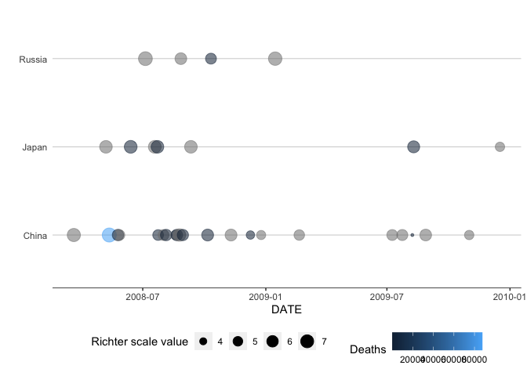
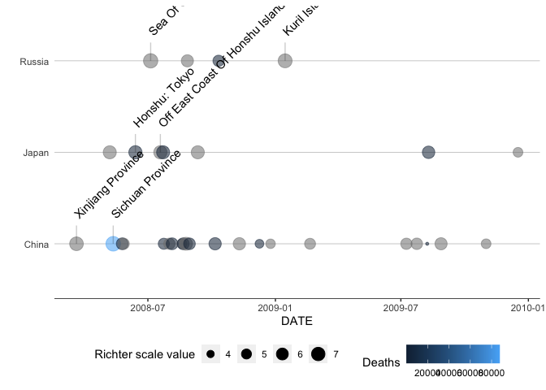

<!-- README.md is generated from README.Rmd. Please edit that file -->

# Mastercap Earthquake Data Visualization Package

<!-- badges: start -->

<!-- badges: end -->

The goal of this package (‘mastercap’) is to provide a few simple tools
to make it easier to visualize earthquake data. It is part of the final
capstone of the Mastering Software Development in R Coursera
specialization.

The four main functions are: 1. clean\_eq\_data() takes raw earthquake
data and reformats it into a tidy Tibble 2. geom\_timeline() takes an
earthquake Tibble and produces a visual timeline of earthquakes 3.
geom\_timeline\_label() is the same as geom\_timeline() but also adds
labels 4. eq\_map() plots earthquakes on an interactive, annotated map

## Example

The first example cleans the raw data and produces an earthquake
timeline to display earthquakes in China, Russia, and Japan between Jan
1, 2008, and Jan 1, 2010.

``` r
raw_data %>%
  clean_eq_data() %>%
  geom_timeline(mindate = "2008-01-01",
                maxdate = "2010-01-01",
                countries = c("China", "Russia", "Japan"))
#> Warning: `tbl_df()` is deprecated as of dplyr 1.0.0.
#> Please use `tibble::as_tibble()` instead.
#> This warning is displayed once every 8 hours.
#> Call `lifecycle::last_warnings()` to see where this warning was generated.
#> Warning: 3 failed to parse.
```



The second example demonstrates the same plot but uses the
geom\_timeline\_label function.

``` r
raw_data %>%
  clean_eq_data() %>%
  geom_timeline_label(mindate = "2008-01-01",
                      maxdate = "2010-01-01",
                      countries = c("China", "Russia", "Japan"))
#> Warning: 3 failed to parse.
```



The final example demonstrates eq\_map. It uses the same filtered data.

``` r
raw_data %>%
  clean_eq_data() %>%
  dplyr::filter(date >= "2008-01-01",
         date <= "2010-01-01",
         country == c("China", "Russia", "Japan")) %>%
  eq_map()
```
